 

### Desarrollador full-stack — cofundador de [Vexa](https://vexa.space/)

Construyo aplicaciones web y móviles de principio a fin: desde el frontend hasta la API y la base de datos.

---

## 🧠 Stack

**Frontend**

**Mobile**

**Backend**

**Base de datos e infra**

---

## 🚀 Vexa — mi startup

**[Vexa](https://vexa.space/)** es un estudio donde desarrollamos software a medida para negocios. Estos son productos que construimos ahí:

<table>
<tr>
<td width="50%" valign="top">

### 🏪 Fivuza
ERP SaaS multi-tenant para pequeños y medianos negocios (bodegas, gimnasios, retail): inventario, ventas y usuarios por tenant.

📂 [Frontend](https://github.com/vexa-dev/FivuzaFrontend) &nbsp;·&nbsp; [Backend](https://github.com/vexa-dev/FivuzaBackend)

</td>
<td width="50%" valign="top">

### 📈 Vantage
Aplicación web de analítica de negocio con API REST en Spring Boot y frontend en React + TypeScript.

📂 [Frontend](https://github.com/vexa-dev/VantageFrontend) &nbsp;·&nbsp; [Backend](https://github.com/vexa-dev/VantageBackend)

</td>
</tr>
</table>

🌐 **[Landing de Vexa](https://github.com/vexa-dev/VexaPage)** — sitio oficial con diseño glassmorphism, portafolio interactivo y formulario de contacto.

---

## 💻 Proyectos propios

<table>
<tr>
<td width="50%" valign="top">

### 💰 EVA
App móvil de finanzas personales: metas de ahorro, planificación de gastos y asistente con IA (Gemini).

📂 [Ver repo](https://github.com/Shiro-Vs/EVA)

</td>
<td width="50%" valign="top">

### 🚗 SAF Service
Sistema de gestión para talleres automotrices: vehículos, clientes, empleados y fichas técnicas.

📂 [Frontend](https://github.com/Shiro-Vs/Automotriz) &nbsp;·&nbsp; [Backend](https://github.com/Shiro-Vs/AutomotrizBackend)

</td>
</tr>
<tr>
<td width="50%" valign="top">

### 📦 SGI — Gestión de Inventarios
API REST para inventario multi-sucursal (minimarkets) con control de acceso por roles (RBAC). Proyecto académico — UTP.

📂 [Frontend](https://github.com/Shiro-Vs/SGI-Frontend) &nbsp;·&nbsp; [Backend](https://github.com/Shiro-Vs/SGI-Backend)

</td>
<td width="50%" valign="top">

### 🧵 Threadbare
Contribución al desarrollo del juego narrativo Threadbare durante el **GamLab 5.0 UTP**.

📂 [Ver repo](https://github.com/Game-Lab-5-0-UTP-Group-4-Team-2/threadbare)

</td>
</tr>
</table>

---

## 📊 Estadísticas

---

📫 Escríbeme por **[LinkedIn](https://www.linkedin.com/in/shirovs/)** o visita **[shirovs.online](https://shirovs.online/)**

